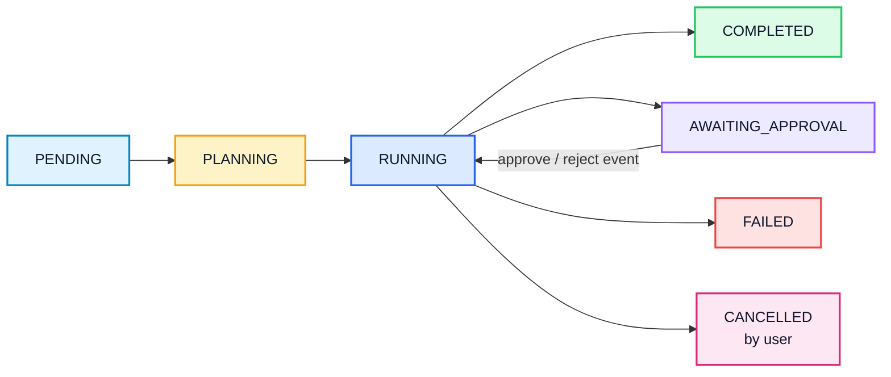
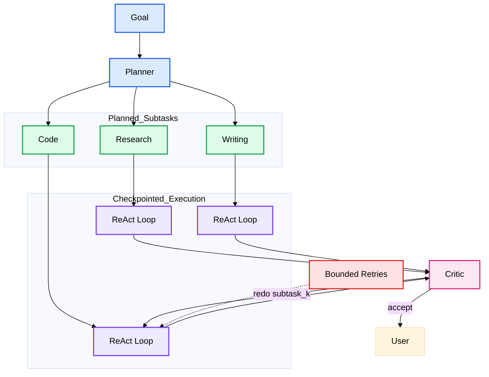
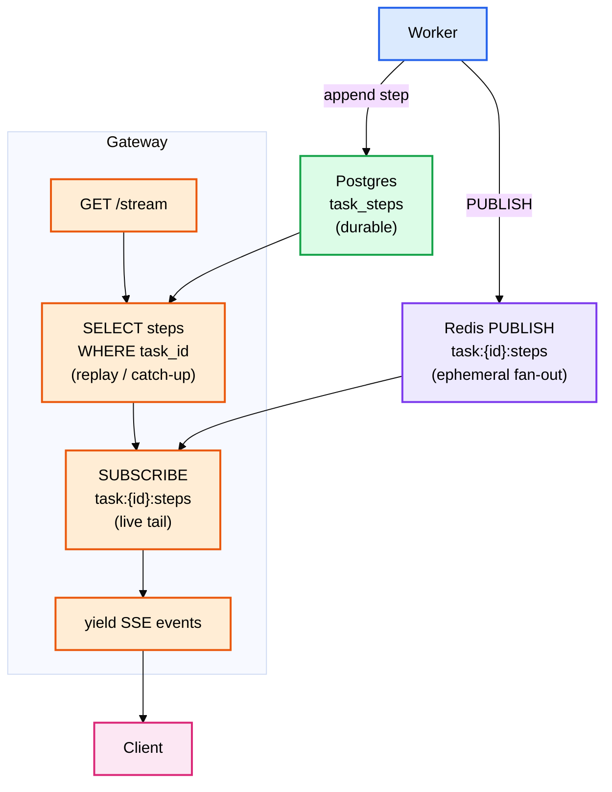
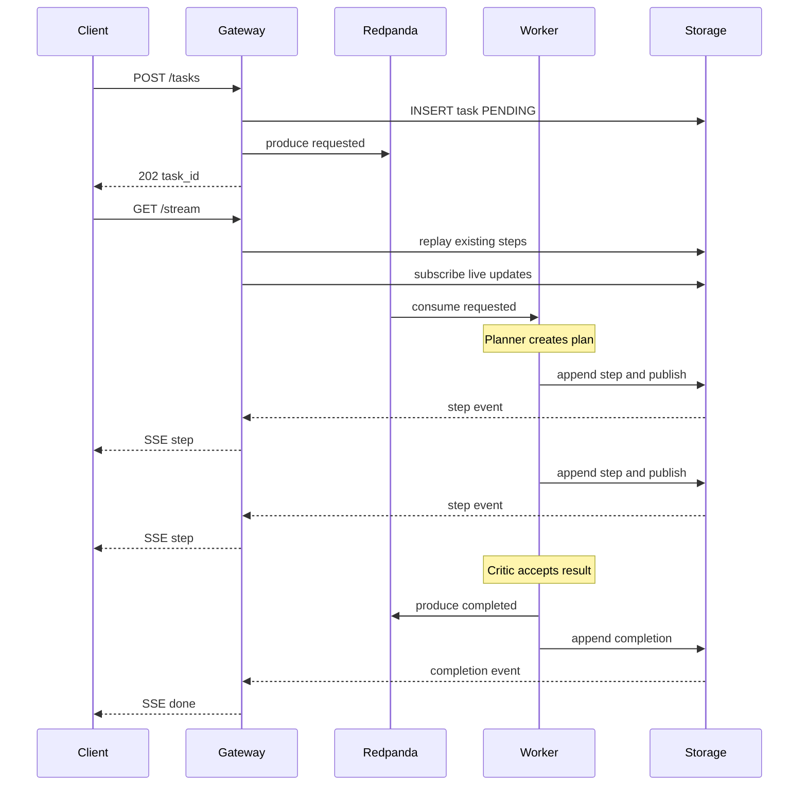
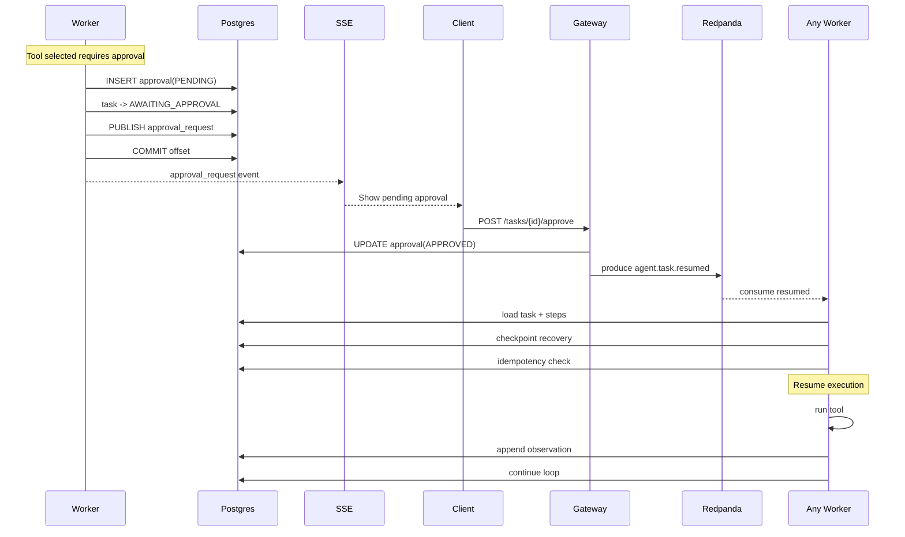

# AI Agents Platform: Complete Design & Implementation Guide

> **Audience**: Engineers who understand distributed systems and have some AI engineering background,
> and who want to build an LLM-agent platform from first principles: without LangChain agents, AutoGen,
> or CrewAI. This is a reference implementation meant to be deployable in production with minor tweaks.
>
> **Prerequisite framing**: This system is the natural successor to
> a [Distributed RAG System](https://github.com/ani03sha/distributed-rag-system). RAG *answers questions*
> from static knowledge. Agents *take actions*: they plan multistep tasks, call tools to interact with
> the world, observe results, and decide what to do next. We reuse the RAG system as one tool among many.

---

## Table of Contents

1. [Executive Summary](#1-executive-summary)
2. [Design Philosophy](#2-design-philosophy)
3. [What This System Is / Is Not](#3-what-this-system-is--is-not)
4. [High-Level Architecture](#4-high-level-architecture)
5. [Core Concepts](#5-core-concepts)
6. [The Agent Execution Model (Checkpoint & Resume)](#6-the-agent-execution-model-checkpoint--resume)
7. [The ReAct Loop](#7-the-react-loop)
8. [Multi-Agent Coordination](#8-multi-agent-coordination)
9. [Tool Registry & Tool Design](#9-tool-registry--tool-design)
10. [Agent Memory](#10-agent-memory)
11. [Human-in-the-Loop](#11-human-in-the-loop)
12. [Data Model (PostgreSQL)](#12-data-model-postgresql)
13. [Event Model (Redpanda)](#13-event-model-redpanda)
14. [Streaming Model (SSE)](#14-streaming-model-sse)
15. [Data Flows & Sequences](#15-data-flows--sequences)
16. [Ports & Adapters](#16-ports--adapters)
17. [Technology Stack & Rationale](#17-technology-stack--rationale)
18. [Observability](#18-observability)
19. [Evaluation Framework](#19-evaluation-framework)
20. [Architecture Decision Records](#20-architecture-decision-records)

---

## 1. Executive Summary

This system is a **production-grade AI Agents Platform**. A user submits a high-level goal ("research the
top 3 consensus algorithms and write a comparison"). The platform decomposes that goal into sub-tasks,
assigns each to a specialist agent, lets each agent reason and use tools in a loop until its sub-task is
done, reviews the combined result, and returns it, pausing for human approval before any high-stakes
action.

### What makes this "production-grade"

- **Not a notebook.** Every component is a deployable, stateless service.
- **No agent framework lock-in.** The ReAct loop, planner, tool dispatch, and memory are implemented from
  scratch behind `Protocol` interfaces. LangChain/AutoGen can later be added as *adapters*, not as the core.
- **Long-running and crash-safe.** Agent state is an append-only step log in PostgreSQL. A task can pause
  for a human for hours and resume on any worker instance. A worker crash mid-task loses nothing.
- **Event-driven.** Tasks are dispatched through Redpanda. The user gets a `task_id` immediately and
  streams reasoning over SSE.
- **Human-in-the-loop is first-class.** High-stakes tool calls block until a human approves or rejects.
- **Observable and evaluated.** structlog + Prometheus + OpenTelemetry → Jaeger, plus an agent-specific
  evaluation harness (task completion rate, tool-call accuracy, step count, approval rate).

### The one-paragraph mental model

> **Core Insight:** A single LLM call is a function: `prompt → text`. An agent is a *loop* around that
> function that also has *hands* (tools) and a *memory* (state). The loop is: think → act → observe →
> repeat. Everything in this platform exists to make that loop reliable, observable, multi-agent, safe,
> and resumable across machines.

---

## 2. Design Philosophy

These are non-negotiable design decisions.

### 2.1 Hexagonal Architecture (Ports & Adapters)

Core agent logic: the ReAct loop, planning, tool dispatch, memory recall, critique, lives in a pure
domain layer with zero infrastructure imports. PostgreSQL, Qdrant, Redis, Redpanda, and Ollama plug in as
adapters behind `Protocol` ports (`LLMProvider`, `ToolRegistry`, `TaskStore`, `AgentMemory`,
`ApprovalGate`, `StepPublisher`, `EventBus`).

**Benefit:** Swap Ollama for OpenAI to benchmark. Swap Qdrant memory for pgvector. Add a real agent
framework as one adapter. The domain never changes.

### 2.2 Event-Driven, Asynchronous Tasks

Agent tasks can take minutes (multistep reasoning, slow local LLM) or hours (waiting on a human). They are
*never* tied to a request/response cycle. The API publishes a task event and returns a `task_id`; the
worker pool executes asynchronously.

### 2.3 Stateless Services

No service holds task state in memory across requests. All durable state lives in PostgreSQL (task +
step log), Qdrant (long-term memory), Redis (live stream relay + caches), and Redpanda (in-flight events).
Any worker can pick up any task. Services die and restart freely.

### 2.4 Build to Understand

We implement ReAct, planning, and tool-calling from scratch. The point is to know exactly what every agent
framework does under the hood: the prompt format, the parse step, the loop termination, the failure modes.
Abstractions earn their place only after we understand what they hide.

### 2.5 Safety Is Designed In, Not Bolted On

High-stakes actions require human approval *by construction*: a tool declares `requires_approval`, and the
execution model physically cannot run it without a recorded decision. Safety is a property of the
architecture, not a prompt instruction the model might ignore.

---

## 3. What This System Is / Is Not

**It is:**

- A multistep, tool-using, multi-agent task executor with human oversight.
- A platform that reuses the RAG system as a *retrieval tool*.

**It is not:**

- A chatbot. There is no free-form conversation loop; there are *goals* and *tasks*.
- An ML training platform. We use a pre-trained local LLM as-is.
- A general workflow engine (Airflow/Temporal). It plans dynamically with an LLM, not from a static DAG.
  (Temporal is a reasonable *future adapter* for the durable-execution layer.
  See [ADR-0002](/docs/adr/0002-checkpoint-and-resume-execution.md).

---

## 4. High-Level Architecture


### Service responsibilities

| Service                  | Responsibility                                                     | Scales with        |
|--------------------------|--------------------------------------------------------------------|--------------------|
| Traefik (gateway)        | TLS, routing, rate limiting                                        | Request volume     |
| Agent Gateway (`api`)    | Auth, submit task, status, SSE stream, approve/reject              | Concurrent clients |
| Agent Runtime (`worker`) | Plan, run ReAct loops, dispatch tools, persist steps, handle HITL  | Active task volume |
| PostgreSQL               | Task state, append-only step log, approvals, audit, API keys       | Total tasks        |
| Redis                    | Live step relay (pub/sub), exact KV cache                          | Stream fan-out     |
| Qdrant                   | Long-term agent memory (embedded facts)                            | Memory size        |
| Ollama                   | LLM generation + embeddings                                        | Token throughput   |
| Redpanda                 | Durable task queue (`requested`, `resumed`, `completed`, `failed`) | Task dispatch rate |

> Orchestration (Planner/Executor/Critic) is *domain logic that runs inside the worker*,
> not a separate service. Making it a standalone service would add a network hop and a second stateful
> thing for zero benefit. The worker is the agent runtime.

---

## 5. Core Concepts

Brief definitions first:

- **ReAct (Reason + Act):** The agent interleaves *reasoning traces* and *actions* (tool calls). It does
  not answer in one shot; it thinks, acts, observes, and repeats until done.
- **Tool:** A typed capability the agent can invoke like search, RAG retrieve, calculator, HTTP. Each carries
  a JSON schema the LLM reads to decide *whether* and *how* to call it.
- **Memory:** *Short-term* = the ordered (thought, action, observation) history of the current task (the
  step log). *Long-term* = facts persisted across tasks in Qdrant, recalled by semantic search.
- **Multi-agent coordination:** A Planner decomposes; specialist Executors run sub-tasks; a Critic reviews.
- **Human-in-the-loop (HITL):** High-stakes tool calls pause for explicit human approval.
- **Agent evaluation:** Not faithfulness/relevancy. Instead: task completion rate, tool-call accuracy,
  steps-to-completion, and human approval rate.

---

## 6. The Agent Execution Model (Checkpoint & Resume)

This is the spine of the platform. See **[ADR-0002](/docs/adr/0002-checkpoint-and-resume-execution.md)** for the
decision rationale.

### The problem

An agent task is long-running and may pause indefinitely for a human. Two naive options both fail:

1. **Run it synchronously in the API request** → timeouts, lost work on disconnect, no horizontal scale.
2. **Run it in a worker that blocks in memory waiting for approval** → a worker crash loses all progress,
   and a human who takes an hour ties up a consumer slot the whole time.

### The model: the step log *is* the checkpoint

We never serialize an opaque "agent object". Instead, **agent state is an append-only log of steps in
PostgreSQL.** Each step is one row: `(task_id, idx, agent_role, thought, action_tool, action_input,
observation)`. The full state of a task at any moment is:

```
task row (goal, status, plan)  +  ordered task_steps  =  complete, reconstructable state
```

To **resume**, a worker loads the task row and its steps, rebuilds the agent's scratchpad (the prompt
context) from that log, and continues the loop. No blob serialization, no pickling, no version skew.

### Lifecycle



- **Park on approval:** When the agent selects a `requires_approval` tool, the worker writes a pending
  `approval` row, sets task status `AWAITING_APPROVAL`, publishes the request to the SSE relay, **commits
  the Kafka offset, and returns.** The consumer slot is freed. Nothing blocks.
- **Resume on decision:** A human POSTs approve/reject. The Gateway records the decision and publishes
  `agent.task.resumed`. *Any* worker consumes it, loads the checkpoint, and continues, executing the tool
  if approved, or feeding the rejection back as an observation so the agent re-plans.

> Because the checkpoint is just durable rows, "resume after a pause" and "recover after
> a crash" are the *same code path*. Crash-safety is free.

### Idempotency

Resume events carry the `approval_id` and the `step_idx` they correspond to. Before executing an approved
tool, the worker checks whether that step already has an observation (i.e. it already ran). At-least-once
delivery from Redpanda can replay; the step log makes replays idempotent.

---

## 7. The ReAct Loop

> ReAct is a *prompt format plus a parse-and-dispatch loop*. There is no magic. The LLM
> emits text in a fixed structure; we parse it, run the requested tool, append the result, and ask again.

### The prompt contract

The agent's system prompt declares the available tools (names + JSON schemas) and demands output in a
strict format. A single LLM turn must produce **either** a Thought + Action, **or** a Thought + Final
Answer:

```
Thought: <reasoning about what to do next>
Action: <tool_name>
Action Input: {"<arg>": "<value>"}
```

…or, to finish:

```
Thought: <why the task is now complete>
Final Answer: <the result>
```

### The loop (worker domain pseudocode)

```
def run(agent, task):
    for step_idx in range(agent.max_steps):
        prompt   = build_prompt(agent, task.steps)        # system + tool schemas + scratchpad
        output   = llm.generate(prompt)                   # one LLM turn
        parsed   = parse_react(output)                    # Thought + (Action|Final Answer)

        if parsed.is_final:
            store.append_step(task, thought=parsed.thought, final=parsed.answer)
            return parsed.answer

        tool = registry.get(parsed.action)                # may raise ToolNotFound → fed back as obs
        if tool.requires_approval:
            approvals.request(task, step_idx, tool, parsed.action_input)
            store.set_status(task, AWAITING_APPROVAL)
            return PARKED                                  # commit offset, release slot

        observation = tool.run(parsed.action_input)        # bounded by timeout
        store.append_step(task, parsed.thought, parsed.action,
                           parsed.action_input, observation)
        publish(task.id, step)                             # SSE relay
    return step_limit_exceeded(task)                       # graceful termination
```

### Termination & guardrails

- **Step budget:** `max_steps` per agent. Hitting it is a graceful `FAILED` with the partial trace, never
  an infinite loop.
- **Malformed output:** A parse failure is fed back to the model as an observation ("Your last output did
  not match the required format…"), giving it one chance to self-correct before counting against the budget.
- **Tool errors:** Tool exceptions become observations, not crashes. The agent decides how to react.

---

## 8. Multi-Agent Coordination

A single agent with every tool is brittle: bloated prompts, tool confusion, no separation of concerns. We
mirror a consulting team.

### Roles

| Agent        | Job                                                                                                  | Tools                           |
|--------------|------------------------------------------------------------------------------------------------------|---------------------------------|
| **Planner**  | Decompose the goal into an ordered list of sub-tasks, each tagged with an executor role              | none (pure reasoning)           |
| **Research** | Gather information                                                                                   | `web_search`, `rag_retrieve`    |
| **Code**     | Compute / call APIs                                                                                  | `calculator`, `http_request`    |
| **Writing**  | Synthesize the final artifact                                                                        | `memory_recall`, `memory_write` |
| **Critic**   | Review the combined result against the original goal; accept or request a redo of specific sub-tasks | none                            |

### Flow



The plan is stored as JSON on the task row. Each sub-task's execution is just more steps in the same step
log, tagged with the executing `agent_role`. The Critic's verdict is also a step. The whole multi-agent run
is therefore *one checkpointed task*: pause/resume/crash-safety all apply uniformly.

**Bounded coordination:** The Critic can trigger at most `N` redo rounds (config) to prevent
planner ↔ critic ping-pong. Exhausting them returns the best result with a "did not fully satisfy" flag.

---

## 9. Tool Registry & Tool Design

See **[ADR-0003](/docs/adr/0003-tool-registry-and-schema-design.md)**.

> The tool *schema* is a prompt. A vague description or sloppy parameter spec is the number one cause of wrong tool
> calls. Tool design is prompt engineering with a type system.

### The `Tool` port

```python
class Tool(Protocol):
    name: str  # stable identifier the LLM emits
    description: str  # WHAT it does + WHEN to use it (this is prompt text)
    parameters_schema: dict  # JSON Schema for arguments (validated before run)
    requires_approval: bool  # high-stakes → HITL gate

    async def run(self, args: dict) -> ToolResult: ...
```

`ToolResult` is `{ ok: bool, content: str, error: str | None }`. The agent only ever sees `content` or
`error` as its observation.

### The registry

`ToolRegistry` holds the tools available to a given agent role, exposes `list_schemas()` (rendered into the
system prompt), validates `action_input` against `parameters_schema` *before* dispatch, and routes to
`run()`. Validation failure is fed back as an observation — the model gets to fix its arguments.

### Initial tool set (code execution deliberately deferred: see ADR-0003)

| Tool            | Description                                       | requires_approval |
|-----------------|---------------------------------------------------|-------------------|
| `web_search`    | Search the web for current information            | no                |
| `rag_retrieve`  | Query the distributed RAG system's knowledge base | no                |
| `calculator`    | Evaluate a safe arithmetic expression             | no                |
| `http_request`  | Make an outbound HTTP call to a whitelisted host  | **yes**           |
| `memory_write`  | Persist a fact to long-term memory                | no                |
| `memory_recall` | Semantic-search long-term memory                  | no                |

A sandboxed `code_execute` tool is a planned later component, added as a new adapter
with zero changes to the loop.

---

## 10. Agent Memory

### Short-term (within a task)

The append-only step log (Section 6). It is the agent's working memory and its checkpoint at once. The
prompt scratchpad is reconstructed from it. For long tasks we cap context by summarizing older steps
(rolling summary) while keeping the full log durable in Postgres.

### Long-term (across tasks)

A Qdrant collection (`agent_memory`), reusing the RAG embedding infrastructure (`nomic-embed-text`). A fact
is `(namespace, text, embedding, metadata, created_at)`. The `WritingAgent`/others write via `memory_write`
and recall via `memory_recall` (semantic top-k, scoped to a `namespace`, e.g. per-user or per-project).

> Long-term memory is just RAG pointed at the agent's own past, not a document corpus. The retrieval machinery is
> identical; only the write path (the agent decides what is worth remembering) is new.

---

## 11. Human-in-the-Loop

See **[ADR-0004](/docs/adr/0004-human-in-the-loop-transport.md)**.

### Transport: SSE down, POST up

- **Downstream (reasoning + approval requests):** Server-Sent Events. The Gateway's
  `GET /v1/tasks/{id}/stream` endpoint, on connect, **replays** existing steps from Postgres (catch-up for
  late joiners), then **live-tails** the Redis pub/sub channel `task:{id}:steps`. This is stateless and
  Traefik-friendly.
- **Upstream (decisions):** Plain `POST /v1/tasks/{id}/approve` / `/reject` with the `approval_id`. No need
  for a bidirectional socket.

### The gate

When an agent selects a `requires_approval` tool, the worker:

1. Writes an `approval` row (`PENDING`) with the tool name, the exact arguments, and the agent's stated
   reason.
2. Sets the task to `AWAITING_APPROVAL` and publishes the request to the SSE relay.
3. Parks the task (commits offset, frees the slot).

The human sees *exactly* what will run and why, then approves or rejects. The Gateway records the decision
and emits `agent.task.resumed`. A rejection is not a failure; it is fed to the agent as an observation
("A human rejected this action because: …"), and the agent re-plans.

> Approval is enforced by the execution model, not by asking the LLM nicely. A `requires_approval` tool *cannot* run
> without a recorded `APPROVED` decision for that exact step.

---

## 12. Data Model (PostgreSQL)

```sql
CREATE TABLE api_keys (
    id           UUID PRIMARY KEY,
    key_hash     TEXT NOT NULL,
    owner        TEXT NOT NULL,
    created_at   TIMESTAMPTZ NOT NULL DEFAULT now(),
    revoked_at   TIMESTAMPTZ
);

CREATE TABLE tasks (
    id           UUID PRIMARY KEY,
    owner        TEXT NOT NULL,
    goal         TEXT NOT NULL,
    status       TEXT NOT NULL,              -- PENDING|PLANNING|RUNNING|AWAITING_APPROVAL|COMPLETED|FAILED|CANCELLED
    plan         JSONB,                      -- [{idx, role, subtask}]
    result       TEXT,
    error        TEXT,
    current_step INT NOT NULL DEFAULT 0,
    created_at   TIMESTAMPTZ NOT NULL DEFAULT now(),
    updated_at   TIMESTAMPTZ NOT NULL DEFAULT now()
);

-- The append-only step log == the checkpoint == short-term memory
CREATE TABLE task_steps (
    id            BIGSERIAL PRIMARY KEY,
    task_id       UUID NOT NULL REFERENCES tasks(id),
    idx           INT  NOT NULL,             -- monotonic per task
    agent_role    TEXT NOT NULL,             -- planner|research|code|writing|critic
    thought       TEXT,
    action_tool   TEXT,                      -- null on a Final Answer step
    action_input  JSONB,
    observation   TEXT,                      -- tool result or final answer
    created_at    TIMESTAMPTZ NOT NULL DEFAULT now(),
    UNIQUE (task_id, idx)                    -- enables idempotent replay
);

CREATE TABLE approvals (
    id           UUID PRIMARY KEY,
    task_id      UUID NOT NULL REFERENCES tasks(id),
    step_idx     INT NOT NULL,
    tool         TEXT NOT NULL,
    tool_input   JSONB NOT NULL,
    reason       TEXT NOT NULL,              -- agent's stated justification
    status       TEXT NOT NULL,              -- PENDING|APPROVED|REJECTED
    decided_by   TEXT,
    decided_at   TIMESTAMPTZ,
    created_at   TIMESTAMPTZ NOT NULL DEFAULT now()
);

CREATE TABLE audit_log (
    id           BIGSERIAL PRIMARY KEY,
    task_id      UUID,
    actor        TEXT NOT NULL,              -- owner | agent_role | system
    event        TEXT NOT NULL,
    detail       JSONB,
    created_at   TIMESTAMPTZ NOT NULL DEFAULT now()
);
```

Long-term memory lives in Qdrant, not Postgres.

---

## 13. Event Model (Redpanda)

| Topic                  | Produced by | Consumed by   | Meaning                                    |
|------------------------|-------------|---------------|--------------------------------------------|
| `agent.task.requested` | Gateway     | Worker        | A new goal to plan and execute             |
| `agent.task.resumed`   | Gateway     | Worker        | A human decision; continue from checkpoint |
| `agent.task.completed` | Worker      | Gateway/admin | Terminal success                           |
| `agent.task.failed`    | Worker      | Gateway/admin | Terminal failure                           |

Event payloads (Pydantic models in `agents_shared/models/events.py`):

```python
class AgentTaskRequested(BaseModel):
    event_type: str = "agent.task.requested"
    version: str = "1.0"
    task_id: str
    owner: str
    goal: str
    timestamp: datetime


class AgentTaskResumed(BaseModel):
    event_type: str = "agent.task.resumed"
    task_id: str
    approval_id: str
    step_idx: int
    decision: str  # "approved" | "rejected"
    timestamp: datetime
```

Delivery is **at-least-once**; the `(task_id, idx)` uniqueness constraint plus the "does this step already
have an observation?" check make consumption idempotent.

> Note: live reasoning steps are streamed over **Redis pub/sub**, not Redpanda. Redpanda is the durable
> *task* queue; Redis is the ephemeral *fan-out* for the UI. Steps are durably stored in Postgres
> regardless.

---

## 14. Streaming Model (SSE)



This is the exact SSE pattern from the RAG query service, extended with a Postgres catch-up replay so a
client that connects late (or reconnects) sees the full reasoning trace, then continues live.

---

## 15. Data Flows & Sequences

### 15.1 Happy path (no approval needed)



### 15.2 Human-in-the-loop pause & resume



### 15.3 Crash recovery

A worker dies mid-task. Redpanda redelivers the unacked event (or a resume event). A different worker loads
the same checkpoint and continues. The `(task_id, idx)` constraint discards any duplicated step.

---

## 16. Ports & Adapters

| Port (`Protocol`) | Responsibility                                  | Initial adapter            |
|-------------------|-------------------------------------------------|----------------------------|
| `LLMProvider`     | `generate(system, user, stream)` → text         | Ollama (`qwen2.5:14b`)     |
| `Tool`            | `name/description/schema/requires_approval/run` | per-tool classes           |
| `ToolRegistry`    | register, list_schemas, validate, dispatch      | in-process registry        |
| `TaskStore`       | create/get/update task, append/get steps        | PostgreSQL (asyncpg)       |
| `ApprovalGate`    | request approval, read decision                 | PostgreSQL                 |
| `StepPublisher`   | publish a step to the live stream               | Redis pub/sub              |
| `EventBus`        | produce / consume topics                        | Redpanda (aiokafka)        |
| `AgentMemory`     | remember / recall long-term facts               | Qdrant + Ollama embeddings |

The domain (`ReActAgent`, `Orchestrator`, `Planner`, `Critic`, prompt builders) imports **only** these
Protocols.

---

## 17. Technology Stack & Rationale

| Concern            | Choice                             | Why                                                   |
|--------------------|------------------------------------|-------------------------------------------------------|
| Language / runtime | Python 3.13, `uv`                  | Fast workspace tooling                                |
| Web framework      | FastAPI + uvicorn                  | Async, SSE-native, reused patterns                    |
| LLM                | Ollama `qwen2.5:14b`               | Local, no API cost, known latency, tool-call-capable  |
| Embeddings         | Ollama `nomic-embed-text`          | Reused from RAG for long-term memory                  |
| Task queue         | Redpanda (Kafka API)               | Durable at-least-once dispatch; reused                |
| Task state         | PostgreSQL                         | Append-only step log + relational task/approval state |
| Live stream relay  | Redis pub/sub                      | Ephemeral SSE fan-out; reused                         |
| Long-term memory   | Qdrant                             | Reuse RAG vector infra                                |
| Agent framework    | **From scratch**                   | Understand before abstracting (ADR-0001)              |
| Gateway            | Traefik                            | TLS, routing, rate limiting; reused                   |
| Observability      | structlog, Prometheus, OTel→Jaeger | Identical stack to RAG                                |
| Auth               | JWT                                | Reused pattern                                        |

---

## 18. Observability

- **structlog:** every step logged with `task_id`, `agent_role`, `step_idx`, `tool`, latency.
- **Prometheus:** `agent_steps_total`, `agent_task_duration_seconds`, `tool_calls_total{tool,outcome}`,
  `tool_latency_seconds{tool}`, `approvals_pending`, `tasks_active{status}`.
- **OpenTelemetry → Jaeger:** a trace per task; a span per ReAct step and per tool call. The reasoning
  trace and the distributed trace align one-to-one — you can replay an agent's "mind" in Jaeger.

> An agent's reasoning trace *is* a distributed trace. Modeling each ReAct step as a span means observability and
> explainability are the same artifact.

---

## 19. Evaluation Framework

Traditional RAG metrics (faithfulness, relevancy) do not apply. We measure agent behavior:

| Metric                   | Definition                                                     |
|--------------------------|----------------------------------------------------------------|
| **Task completion rate** | % of eval tasks reaching `COMPLETED` with an acceptable result |
| **Tool-call accuracy**   | % of tool selections that match the expected tool for the step |
| **Steps-to-completion**  | Distribution of step counts (efficiency)                       |
| **Approval rate**        | % of approval requests a human approved (calibration of HITL)  |

A golden suite of tasks with expected tool traces lives in `evals/datasets/`. An LLM-as-judge scores final
answers against the goal. Mirrors the RAGAS harness structurally.

---

## 20. Architecture Decision Records

| ADR                                                 | Decision                                              |
|-----------------------------------------------------|-------------------------------------------------------|
| [0001](adr/0001-build-agents-from-scratch.md)       | Build the agent core from scratch, no agent framework |
| [0002](adr/0002-checkpoint-and-resume-execution.md) | Event-driven, checkpoint-and-resume execution model   |
| [0003](adr/0003-tool-registry-and-schema-design.md) | Schema-first tool registry; defer code execution      |
| [0004](adr/0004-human-in-the-loop-transport.md)     | SSE-down / POST-up for streaming and approvals        |
